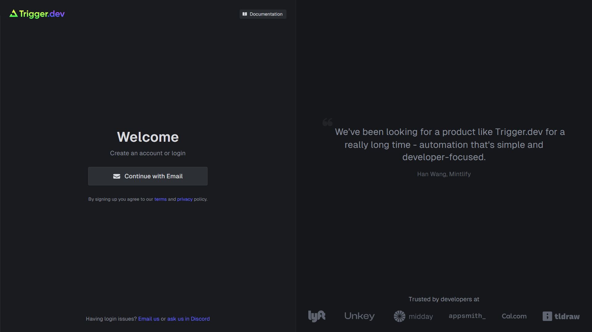

# trigger.dev — self-hosted background jobs



A self-hosted [Trigger.dev v4](https://trigger.dev) stack for running background tasks and workflows. Trigger.dev executes long-running, event-driven, and scheduled tasks in isolated worker containers, keeping them out of your web server.

---

## Prerequisites

- Docker with Compose v2 (`docker compose` command)
- **Garage** object-store running (`makerops-core/infrastructure/garage/start.sh`)
- Docker daemon configured to allow the local insecure registry:

  Add to `/etc/docker/daemon.json` and restart Docker:

  ```json
  { "insecure-registries": ["localhost:5000"] }
  ```

---

## Quick start

```bash
# 1. Copy the template and start (first run generates all secrets)
cp .env.example .env
./start.sh

# 2. Open the UI and sign in via magic link
#    URL: http://localhost:3040
#    Retrieve link: docker logs trigger_webapp 2>&1 | grep -i magic

# 3. Create a project in the dashboard and note the project ref
```

---

## Architecture

Eight containers managed by this stack, plus the shared Garage service:

```text
┌────────────────────────────────────────────────────┐
│  webapp  (:3040)  ─── postgres, redis, clickhouse  │
│           │                                         │
│           ├── electric  (real-time sync)            │
│           ├── registry  (:5000, worker images)      │
│           └── supervisor ──▶ docker-proxy           │
│                              (socket proxy)         │
└────────────────────────────────────────────────────┘
         ▲
  Garage (:3900)  (shared infrastructure, object store)
```

| Container | Image | Role |
| --- | --- | --- |
| `trigger_webapp` | `ghcr.io/triggerdotdev/trigger.dev:v4.4.6` | UI, API, task scheduler |
| `trigger_db` | `postgres:16` | Task history, configs, run state |
| `trigger_redis` | `redis:7` | Job queue and pub/sub |
| `trigger_electric` | `electricsql/electric:1.2.4` | Real-time PostgreSQL sync |
| `trigger_clickhouse` | `clickhouse/clickhouse-server` | Run analytics and replication |
| `trigger_registry` | `registry:2` | Worker image registry |
| `trigger_docker_proxy` | `tecnativa/docker-socket-proxy` | Secure Docker socket proxy |
| `trigger_supervisor` | `ghcr.io/triggerdotdev/supervisor:v4` | Worker lifecycle (replaces provider + coordinator) |
| Garage | `dxflrs/garage` | Object storage for payloads/outputs (external) |

**Networks:**

- `webapp` — webapp, postgres, redis, electric, clickhouse, registry
- `supervisor` — webapp, supervisor (task coordination)
- `docker-proxy` — supervisor, docker-proxy (socket access)

---

## Scripts

| Script | What it does |
| --- | --- |
| `start.sh` | Generates secrets, sources Garage credentials, creates bucket, starts stack |
| `stop.sh` | Stops containers, preserves data volumes |
| `teardown.sh` | Interactive full teardown — removes all containers, volumes, images, and networks |
| `magic-link-helper.sh` | Extracts the latest magic-link login URL from webapp logs |

### stop.sh flags

```bash
./stop.sh              # stop containers, keep data
./stop.sh --volumes    # stop and delete data volumes
```

---

## Environment variables

### Changed from v3

| v3 var | v4 replacement | Notes |
| --- | --- | --- |
| `PROVIDER_SECRET` | `MANAGED_WORKER_SECRET` | Single secret for webapp ↔ supervisor |
| `COORDINATOR_SECRET` | _(removed)_ | Merged into supervisor |
| `V3_ENABLED` | _(removed)_ | No longer needed |
| `REMIX_APP_PORT` / `PORT` | _(removed)_ | Internal port is now 3000 (mapped to host `LISTEN_PORT`) |
| `ELECTRIC_IMAGE_TAG=latest` | `ELECTRIC_IMAGE_TAG=1.2.4` | Pinned |
| `RUNTIME_PLATFORM` | _(removed)_ | |

### New in v4

| Variable | Description |
| --- | --- |
| `APP_ORIGIN` / `LOGIN_ORIGIN` / `API_ORIGIN` | Derived from `TRIGGER_PROTOCOL` + `TRIGGER_DOMAIN` |
| `MANAGED_WORKER_SECRET` | Shared webapp ↔ supervisor secret |
| `CLICKHOUSE_*` | ClickHouse connection and credentials |
| `RUN_REPLICATION_*` | Run data replication to ClickHouse |
| `OBJECT_STORE_*` | Garage S3 connection (sourced automatically) |
| `DOCKER_REGISTRY_*` | Local container registry credentials |

### Immutable secrets (never change after first run)

- `ENCRYPTION_KEY` — changing makes all stored encrypted data unreadable
- `MAGIC_LINK_SECRET` — changing invalidates outstanding login links
- `SESSION_SECRET` — changing logs out all active users

---

## Migrating from v3

v3 is EOL July 1 2026. To upgrade:

```bash
# 1. Tear down the v3 stack (data will be lost)
./teardown.sh

# 2. Reset to v4 template
cp .env.example .env
rm -f registry/auth.htpasswd

# 3. Start fresh
./start.sh
```

---

## Debugging

```bash
# Container status
docker compose -p triggerdev ps

# Tail all logs
docker compose -p triggerdev logs -f

# Tail webapp only
docker compose -p triggerdev logs -f webapp

# Tail supervisor
docker compose -p triggerdev logs -f supervisor

# Get the magic-link login URL
./magic-link-helper.sh

# Check Garage bucket
docker exec garage /garage bucket list
```

---

## Upgrade

```bash
# 1. Update TRIGGER_IMAGE_TAG in .env to the desired version
# 2. Stop and restart (migrations run automatically on webapp startup)
./stop.sh && ./start.sh
```

See [Trigger.dev releases](https://github.com/triggerdotdev/trigger.dev/releases) for version notes.

---

## Further reading

- [Trigger.dev self-hosting docs](https://trigger.dev/docs/self-hosting)
- [Trigger.dev v4 changelog](https://trigger.dev/changelog)
- [SDK setup for connecting applications](https://trigger.dev/docs/quick-start)
